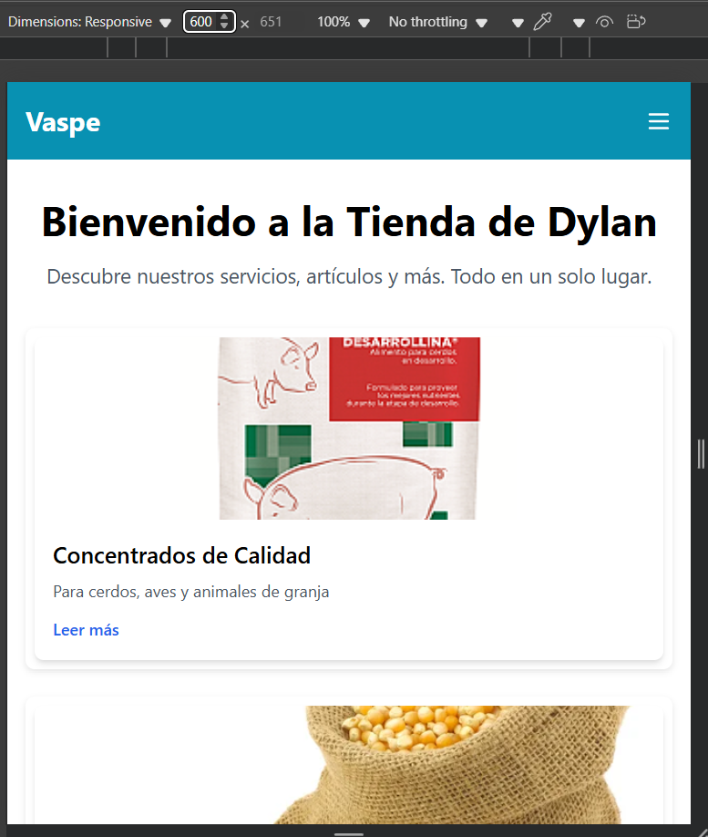
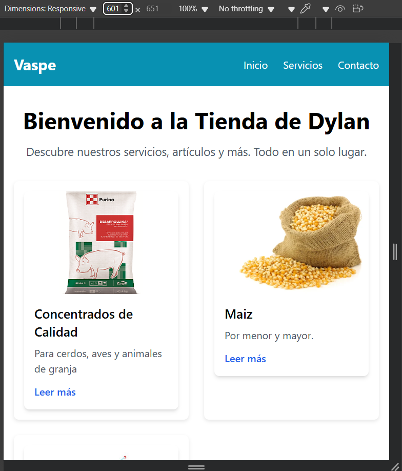
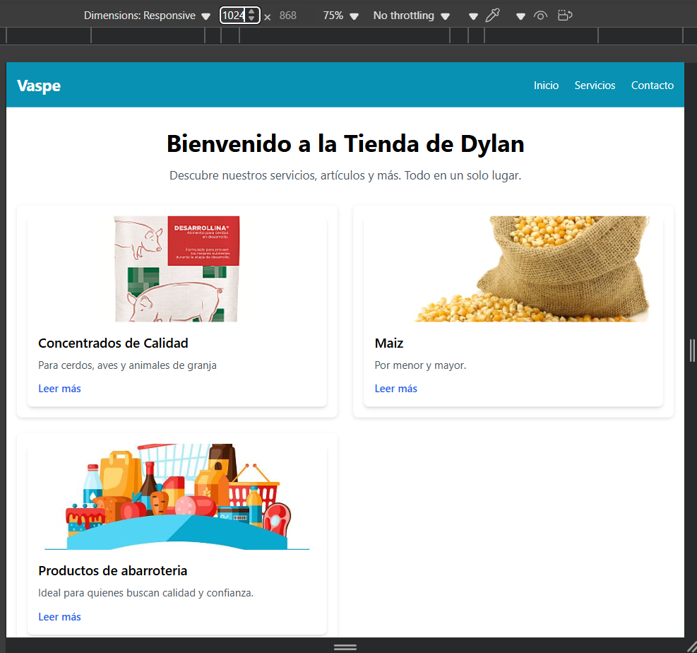
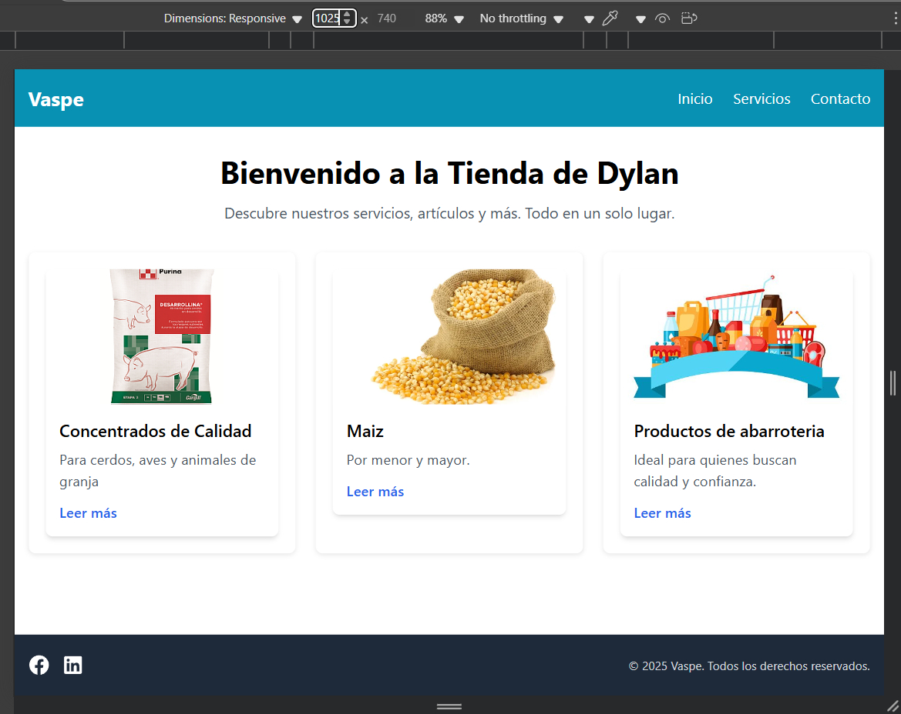

# 🛒 Tienda de Dylan – Proyecto Responsivo con React + TailwindCSS

Este proyecto es una **tienda web responsiva** creada con **React**, **TailwindCSS** y CSS personalizado con **Media Queries**. Incluye un **header adaptable**, una sección de **tarjetas dinámicas** y un **footer**. El objetivo es mostrar cómo aplicar **responsividad** en diferentes dispositivos y tamaños de pantalla.

🚀 **Deploy en Vercel**: [tarea-responsiva.vercel.app](https://tarea-responsiva.vercel.app/)

---

## 📌 Características
- **Diseño responsivo** con **TailwindCSS** y **Media Queries** personalizadas.
- **Header adaptable** con menú hamburguesa en móviles.
- **Tarjetas ajustables** (1, 2 o 3 columnas según el tamaño de pantalla).
- **Animaciones y transiciones suaves** con Tailwind.
- **Iconos** integrados para el menú y enlaces.
- Despliegue en **Vercel** para visualización en tiempo real.

---

## 🖼 Capturas de pantalla







---

## 🛠 Tecnologías utilizadas
- **React** – Librería de JavaScript para construir interfaces.
- **TailwindCSS** – Framework CSS para estilos rápidos y responsivos.
- **Media Queries** – Para ajustes de diseño personalizados.
- **Heroicons / Lucide Icons** – Iconos SVG.
- **Vercel** – Plataforma de despliegue.

---

## 🎯 Media Queries aplicadas

📱 **Móviles** (≤ 600px)
- Menú de navegación cambia a **hamburguesa**.
- Tarjetas en **1 columna**.
- Fuente y márgenes ajustados para legibilidad.

💻 **Tabletas** (601px – 1024px)
- Tarjetas en **2 columnas**.
- Texto y espaciado optimizados para pantallas medianas.

🖥 **Escritorio** (≥ 1025px)
- Tarjetas en **3 columnas**.
- Diseño optimizado con más espacio y proporciones adaptadas.

```css
/* Ejemplo simplificado */
@media (max-width: 600px) {
  .card-section { grid-template-columns: 1fr; }
}
@media (min-width: 601px) and (max-width: 1024px) {
  .card-section { grid-template-columns: repeat(2, 1fr); }
}
@media (min-width: 1025px) {
  .card-section { grid-template-columns: repeat(3, 1fr); }
}


📥 Instalación y uso
1️⃣ Clonar el repositorio
bash
git clone https://github.com/usuario/mi-repo.git
cd mi-repo
2️⃣ Instalar dependencias
bash
npm install
3️⃣ Ejecutar en desarrollo
bash
npm run dev
4️⃣ Abrir en el navegador
Visita http://localhost:5173 o el puerto que indique la terminal.

🌐 Deploy
El proyecto está desplegado en Vercel:
https://tarea-responsiva.vercel.app/

📄 Licencia
Este proyecto está bajo la licencia MIT – Libre para uso y modificación.

markdown
Con esto tu repositorio quedará **profesional y claro** para cualquiera que lo vea.  
Si quieres, también puedo agregar al README un apartado para explicar **cómo modificar las Media Queries de `index.css`** para que quede más didáctico.
